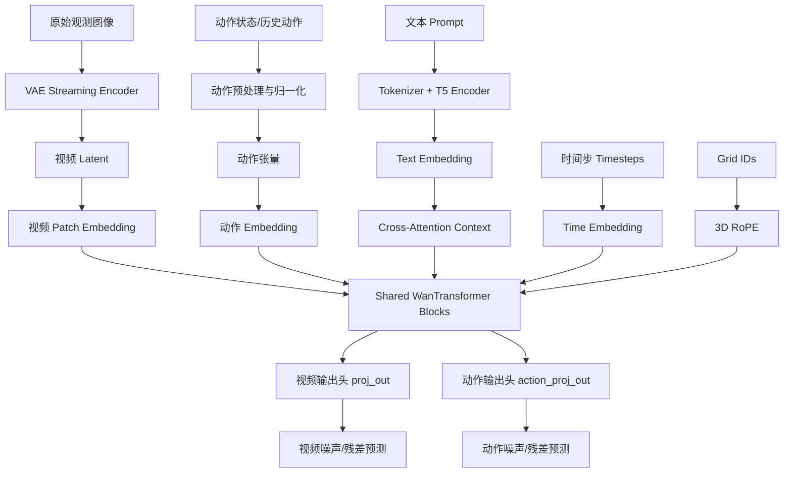
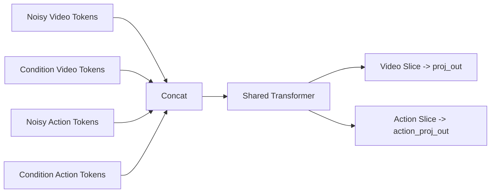
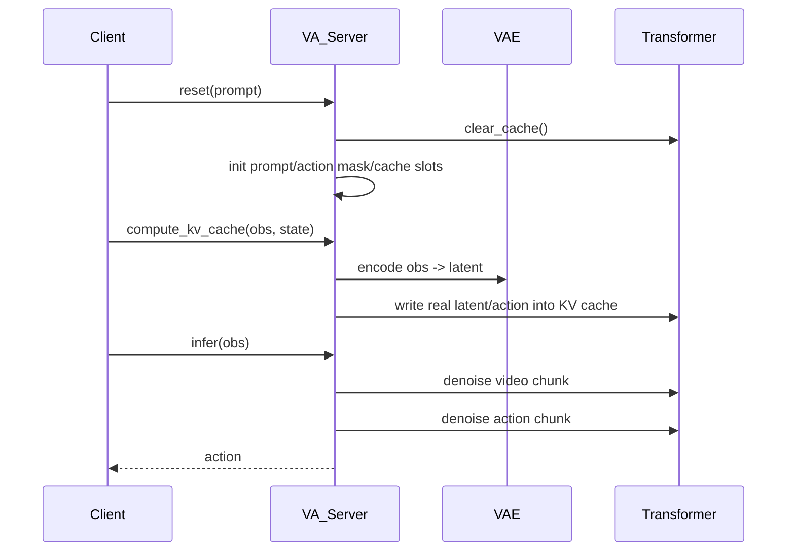

# LingBot-VA 项目架构解析

本文基于当前仓库代码实现进行说明，重点解释：

- 模型主架构是什么
- 各组件分别负责什么
- 训练与推理时数据如何流动
- 视频 latent、动作序列、文本条件之间如何在同一个 Transformer 里协同
- 服务端部署、分布式、KV Cache、注意力掩码之间的关系

---

## 1. 项目整体定位

从当前实现看，LingBot-VA 是一个“视频 latent 建模 + 动作建模”的统一世界模型。它并不是把视频模型和动作模型完全拆成两个独立网络，而是：

1. 共享一个 `WanTransformer3DModel`
2. 视频 token 和动作 token 通过不同的输入/输出头进入同一个 Transformer
3. 文本条件通过 cross-attention 注入
4. 时间步嵌入用于 diffusion / flow matching 训练
5. 推理时通过 KV Cache 把历史观测和历史动作滚动缓存起来，实现长时序在线控制

对应代码主线：

- 模型定义：`wan_va/modules/model.py`
- 模型加载工具：`wan_va/modules/utils.py`
- 训练入口：`wan_va/train.py`
- 数据集：`wan_va/dataset/lerobot_latent_dataset.py`
- 推理服务：`wan_va/wan_va_server.py`
- 调度器：`wan_va/utils/scheduler.py`
- 配置系统：`wan_va/configs/*.py`

---

## 2. 项目目录与职责

### 2.1 核心目录

- `wan_va/modules/`
  - 定义 Transformer 主体、注意力、RoPE、输入输出投影
- `wan_va/dataset/`
  - 定义训练数据读取逻辑，负责从 LeRobot 数据集和预提取 latent 中组装训练样本
- `wan_va/configs/`
  - 不同环境、不同推理模式、训练参数配置
- `wan_va/utils/`
  - 调度器、日志、mesh id、异步保存、服务端辅助逻辑
- `wan_va/distributed/`
  - FSDP 包装、分布式初始化
- `evaluation/robotwin/`
  - RoboTwin 客户端评测脚本
- `script/`
  - 启动训练和服务端的 shell 脚本

### 2.2 两条主执行链

#### 训练链

`script/run_va_posttrain.sh`
-> `python -m wan_va.train`
-> `Trainer`
-> `MultiLatentLeRobotDataset`
-> `WanTransformer3DModel.forward(train_mode=True)`

#### 推理链

`script/run_launch_va_server_sync.sh`
-> `python -m wan_va.wan_va_server`
-> `VA_Server`
-> websocket server
-> 客户端发送观测 / reset / cache 指令
-> 模型返回动作

---

## 3. 配置系统如何驱动整个项目

配置入口在 `wan_va/configs/__init__.py`，通过 `VA_CONFIGS` 把不同场景注册成名字：

- `robotwin`
- `franka`
- `robotwin_i2av`
- `franka_i2av`
- `robotwin_train`
- `demo`
- `demo_train`
- `demo_i2av`

### 3.1 共享配置

`wan_va/configs/shared_config.py` 提供通用配置：

- `host` / `port`
- `param_dtype`
- `save_root`
- `patch_size=(1, 2, 2)`
- `enable_offload`

这里的 `patch_size=(1,2,2)` 很关键：

- 视频 latent 会在空间维上做 `2x2` patch 化
- 时间维不 patch
- 动作序列不走 patchify，动作始终按单步 token 处理

### 3.2 环境配置

例如 `wan_va/configs/va_robotwin_cfg.py` 定义：

- 预训练模型路径 `wan22_pretrained_model_name_or_path`
- 注意力窗口 `attn_window`
- 每次处理多少帧 `frame_chunk_size`
- 图像高宽
- 动作维度 `action_dim=30`
- 每帧包含多少个动作子步 `action_per_frame`
- 使用哪些相机 `obs_cam_keys`
- CFG 强度
- 视频与动作各自的 diffusion step 数
- 动作归一化统计量 `norm_stat`
- `used_action_channel_ids` / `inverse_used_action_channel_ids`

这些配置直接决定：

- 输入图像如何拼接
- latent 尺寸
- 动作通道如何映射到模型内部表示
- 推理时 cache 容量
- 训练时 scheduler 的噪声分布

### 3.3 训练配置

例如 `wan_va/configs/va_robotwin_train_cfg.py` 在环境配置基础上增加：

- `dataset_path`
- `empty_emb_path`
- `enable_wandb`
- `load_worker`
- `save_interval`
- `cfg_prob`
- 学习率、权重衰减、warmup、batch size、梯度累积、训练步数

也就是说，训练配置本质上是：

“环境定义 + 数据路径 + 优化器参数 + 日志/保存策略”

---

## 4. 数据是怎么进入模型的

### 4.1 数据集总体设计

训练数据类在 `wan_va/dataset/lerobot_latent_dataset.py`：

- `MultiLatentLeRobotDataset`
- `LatentLeRobotDataset`

这里不是直接从原始视频做在线编码训练，而是读取：

1. LeRobot 格式的原始动作/元数据
2. 预先提取好的视频 latent 文件

所以训练时视频编码器 VAE 不参与前向，训练只更新 Transformer。

### 4.2 多数据集包装

`MultiLatentLeRobotDataset` 会：

- 递归搜索 `dataset_path` 下所有 `info.json`
- 每个数据仓库构建一个 `LatentLeRobotDataset`
- 把多个子数据集拼成一个总数据集

这样做的好处是训练可以混合多个 LeRobot repo。

### 4.3 单条样本的组成

`LatentLeRobotDataset.__getitem__()` 最终返回：

- `latents`
- `text_emb`
- `actions`
- `actions_mask`

其中：

#### `latents`

- 从各相机对应的 `.pth` latent 文件中读取
- 每个相机文件里包含：
  - latent 本体
  - latent 的帧数、高宽
  - frame id
  - text embedding
- 多路相机 latent 会按环境规则拼起来

对于 `robotwin_tshape`：

- 左右腕相机先沿宽度拼
- 再与高位相机沿高度拼

所以它不是简单 channel 拼接，而是构造成一个 T-shape 的空间布局，再交给统一视频 latent 主干。

#### `text_emb`

- 来自 latent 文件中保存的文本 embedding
- 按 `cfg_prob` 有概率被替换为 `empty_emb`
- 这是训练阶段的 classifier-free guidance dropout

#### `actions`

- 从 LeRobot 的 `action` 读出
- 根据 latent 对应的采样帧对齐动作时间轴
- 对 RoboTwin 双臂场景会转成相对位姿
- 再 pad、重排、归一化，最终组织成：
  - `C x F x N x 1`
  - 其中 `N` 通常是 `action_per_frame`

#### `actions_mask`

- 与动作张量同形状
- 表示哪些动作位置有效
- 训练动作损失时只在 mask 为真的位置计算

### 4.4 动作通道映射

代码里动作原始总维度是 30，但不是所有维度都有意义。

配置中的：

- `used_action_channel_ids`
- `inverse_used_action_channel_ids`

用于在“真实动作空间”和“模型内部动作通道”之间做映射。

这个设计让模型接口固定为 30 维，但不同机器人只激活其中一部分通道。

---

## 5. 模型总览

核心模型是 `wan_va/modules/model.py` 中的 `WanTransformer3DModel`。

从结构上看，它是一个：

- 共享主干 Transformer
- 双输入头（视频 latent / 动作）
- 双输出头（视频预测 / 动作预测）
- 文本 cross-attention 条件
- 时间步调制
- RoPE 位置编码
- 支持 `torch` / `flashattn` / `flex` 三种注意力实现

### 5.1 顶层模块清单

`WanTransformer3DModel.__init__()` 里主要包含：

- `self.rope`
  - 三维 rotary position embedding
- `self.patch_embedding_mlp`
  - 视频 latent token 的输入投影
- `self.action_embedder`
  - 动作 token 的输入投影
- `self.condition_embedder`
  - 时间步嵌入和文本投影
- `self.condition_embedder_action`
  - 动作分支独立一份 condition embedder
- `self.blocks`
  - 多层 `WanTransformerBlock`
- `self.norm_out`
  - 输出层归一化
- `self.proj_out`
  - 视频输出头
- `self.action_proj_out`
  - 动作输出头
- `self.scale_shift_table`
  - 输出层的时间调制参数

### 5.2 共享主干，分离头部

这套架构最关键的点是：

- 视频 token 和动作 token 并不共享输入投影
- 但它们共享几乎全部 Transformer block
- 最后分别走不同输出头

可以理解成：

同一个时空语义空间中，视频状态和动作计划都被编码成 token，然后通过统一自回归/因果建模学习两者关系。

---

## 6. 输入表示：视频、动作、文本、时间

## 6.1 视频 latent token 化

视频输入 shape 是：

- `B x C x F x H x W`

在 `_input_embed(..., input_type='latent')` 中会被重排为：

- `B x (F*H'*W') x (C*p1*p2*p3)`

其中：

- `p1,p2,p3 = patch_size`
- 当前默认 `patch_size=(1,2,2)`

然后经过：

- `patch_embedding_mlp`

投影到统一 hidden dim。

这意味着视频 token 的基本单位不是单个 latent cell，而是一个 `1x2x2` 的小 patch。

## 6.2 动作 token 化

动作输入 shape 是：

- `B x C x F x H x W`

但对动作来说通常 `W=1`，`H=action_per_frame`。

在 `_input_embed(..., input_type='action')` 中会变成：

- `B x (F*H*W) x C`

再经过：

- `action_embedder`

映射到与视频相同的 hidden dim。

也就是说，动作分支不做 patchify，而是“一步动作一个 token”。

## 6.3 文本条件

文本 embedding 通过：

- `PixArtAlphaTextProjection`

被投影到与主干一致的维度，然后在每个 block 里通过 cross-attention 注入。

所以文本不是拼接进主序列，而是作为 `encoder_hidden_states` 独立存在。

## 6.4 时间步条件

时间步嵌入由 `WanTimeTextImageEmbedding` 完成：

1. `Timesteps` 生成正弦时间编码
2. `TimestepEmbedding` 投影到 hidden dim
3. `time_proj` 再投影出调制向量

模型里时间步条件主要有两种用途：

1. 给输出层做 scale/shift 调制
2. 给每个 Transformer block 的注意力和 FFN 残差分支做 AdaLN 风格调制

---

## 7. 位置编码：WanRotaryPosEmbed

`WanRotaryPosEmbed` 不是普通 1D RoPE，而是把 head dim 分成三部分：

- `f_dim` 对应时间/帧
- `h_dim` 对应高度
- `w_dim` 对应宽度

输入 `grid_ids` 后，分别对 `f/h/w` 生成频率，再拼成复数形式的 rotary embedding。

这样视频 token 可以携带 3D 空间位置信息。

对动作 token，`get_mesh_id(..., action=True)` 做了特殊处理：

- 帧坐标 `f` 保留
- `h` 和 `w` 置为 `-1`
- 还会给 `f` 增加一个与动作槽位相关的偏移

这表示：

- 动作 token 共享“时间轴”
- 但它们不被解释成真实图像空间中的二维位置

---

## 8. 注意力模块与 Block 结构

### 8.1 WanAttention

`WanAttention` 封装了三种注意力内核：

- `torch` -> `scaled_dot_product_attention`
- `flashattn` -> `flash_attn_func`
- `flex` -> PyTorch `flex_attention`

它内部做：

1. `to_q / to_k / to_v`
2. `RMSNorm` 归一化 Q/K
3. 可选 RoPE
4. 调用具体注意力实现
5. `to_out`

### 8.2 KV Cache 设计

`WanAttention` 的一个重要实现细节是自带 KV cache。

缓存结构包含：

- `k`
- `v`
- `id`
- `mask`
- `is_pred`

其中：

- `update_cache=0`
  - 临时写入 cache 后又恢复，不保留
- `update_cache=1`
  - 保留，并标记 `is_pred=True`
- `update_cache=2`
  - 保留，但标记 `is_pred=False`

推理时利用这个机制区分：

- 历史真实观测产生的 cache
- 当前模型预测产生的 cache

随后 `clear_pred_cache()` 只清理预测 token，保留真实上下文 token。

### 8.3 WanTransformerBlock

每个 block 包含三段：

1. Self-Attention
2. Cross-Attention（对文本）
3. FeedForward

并通过 `scale_shift_table` + `temb` 做调制。

这个 block 不是标准 Pre-LN Transformer，而是更接近 diffusion Transformer 常见的 AdaLN / scale-shift-gate 结构：

- 对 self-attn 前输入做 `scale + shift`
- 用 `gate_msa` 控制残差注入强度
- FFN 前也做一次独立的 `scale + shift`

所以时间步条件不是简单加法，而是深度参与 block 内部调制。

---

## 9. 训练时真正输入给 Transformer 的是什么

这一部分是当前代码里最重要、也最容易看错的地方。

`WanTransformer3DModel.forward_train()` 并不是只输入“噪声视频”或“噪声动作”，而是把四段序列拼在一起：

1. `latent_hidden_states`
   - 加噪后的视频 latent token
2. `condition_latent_hidden_states`
   - 条件视频 latent token
3. `action_hidden_states`
   - 加噪后的动作 token
4. `condition_action_hidden_states`
   - 条件动作 token

最终：

```text
hidden_states =
  [ noisy_video ,
    cond_video  ,
    noisy_action,
    cond_action ]
```

这就是 README 里“视频-动作统一建模”在代码里的真正落点。

### 9.1 这些条件 token 来自哪里

在 `Trainer._prepare_input_dict()` 中：

- `latent_dict = _add_noise(latents, ...)`
- `action_dict = _add_noise(actions, ...)`

`_add_noise()` 返回：

- `noisy_latents`
- `targets`
- `latent`
- `timesteps`
- `cond_timesteps`
- `grid_id`

其中：

- `noisy_latents` 是训练输入
- `latent` 是条件输入
- `targets` 是回归目标

视频分支还支持 `noisy_cond_prob=0.5`，即条件视频本身也可能被加噪，从而增强鲁棒性。

### 9.2 为什么要拼四段

这样模型能同时学到：

- 如何从当前噪声视频恢复未来视频
- 如何从当前噪声动作恢复动作序列
- 视频与动作之间的耦合关系
- 干净条件与噪声目标之间的因果依赖

本质上，这是一种“统一序列上的条件流匹配训练”。

---

## 10. FlexAttention 掩码机制

训练时如果 `attn_mode='flex'`，模型会调用 `FlexAttnFunc.init_mask()` 动态构造块稀疏掩码。

这里用了三类信息：

- `seq_ids`
  - 区分 batch 内不同样本
- `frame_ids`
  - 区分时序位置，并且把视频块与动作块做交错编号
- `noise_ids`
  - 区分 noisy token 和 clean/condition token

### 10.1 掩码逻辑

`_get_mask_mod()` 组合了几类规则：

- `clean -> clean`
  - 允许看见当前及过去
- `noisy -> clean`
  - 只能看见严格过去，不能偷看同一步自身 clean token
- `noisy -> noisy`
  - 只允许同一 frame block 内交互
- 再叠加：
  - 同一序列约束
  - 局部窗口约束 `window_size`

这说明训练并不是全连接 self-attention，而是显式编码了因果结构。

### 10.2 为什么 frame id 要交错编码

在 `init_mask()` 中：

- 视频块帧编号被映射为 `... , 0, 2, 4, ...`
- 动作块帧编号被映射为 `... , 1, 3, 5, ...`

这等价于把时间轴离散成：

`视频_t0 -> 动作_t0 -> 视频_t1 -> 动作_t1 -> ...`

因此掩码能在统一序列里精确控制视频和动作之间的先后关系。

---

## 11. 训练流程

训练入口在 `wan_va/train.py`。

### 11.1 Trainer 初始化流程

`Trainer.__init__()` 做了这些事：

1. 初始化 wandb
2. 加载预训练 Transformer
3. 对 block 应用 activation checkpointing
4. 用 FSDP 包装模型
5. 构建 AdamW 优化器
6. 构建学习率调度器
7. 构建数据集和 DataLoader
8. 初始化视频 scheduler 和动作 scheduler

注意：

- 训练阶段只加载 Transformer
- 不加载 VAE / text encoder 做训练前向
- 因为视频 latent 和文本 embedding 已经离线准备好了

### 11.2 噪声添加

`Trainer._add_noise()` 对视频和动作分别做 flow matching 风格噪声扰动：

- 采样时间步
- 生成高斯噪声
- `scheduler.add_noise(...)`
- 生成训练目标 `noise - sample`

视频和动作各自有不同的 scheduler：

- `train_scheduler_latent`
- `train_scheduler_action`

这允许视频和动作分支使用不同的 SNR shift。

### 11.3 前向与 loss

`_train_step()` 的主流程：

1. batch 放到 GPU
2. 准备 `input_dict`
3. `self.transformer(input_dict, train_mode=True)`
4. 得到：
   - `latent_pred`
   - `action_pred`
5. 与 `targets` 做 MSE
6. 按时间步权重加权
7. 对动作使用 `actions_mask`
8. 反传、裁剪梯度、optimizer.step

### 11.4 视频 loss

视频输出先通过 `data_seq_to_patch()` 从序列恢复回 patch 布局，再与目标 latent 比较。

视频 loss 是逐帧归一化的 MSE。

### 11.5 动作 loss

动作输出被重排回：

- `B x C x F x N x 1`

然后只对 `actions_mask=True` 的位置计算 MSE。

所以整个训练目标可以概括成：

`L = L_video + L_action`

只是两项内部都带有时间步权重和有效位置 mask。

---

## 12. 推理服务架构

推理主入口在 `wan_va/wan_va_server.py`，核心类是 `VA_Server`。

它加载四类组件：

1. `VAE`
2. `WanVAEStreamingWrapper`
3. `Tokenizer + TextEncoder`
4. `WanTransformer3DModel`

### 12.1 为什么推理要加载 VAE 和文本编码器

因为在线推理时输入不再是离线 latent，而是：

- 原始观测图像
- 文本 prompt
- 历史动作状态

所以必须在线完成：

- 图像 -> latent
- 文本 -> embedding

### 12.2 VAE 流式编码

`WanVAEStreamingWrapper` 的目的是：

- 复用 VAE 编码器内部因果卷积缓存
- 支持分块编码连续视频

在在线机器人控制里，这能避免每来一帧就重新编码全部历史。

### 12.3 服务端三种请求语义

`VA_Server.infer()` 支持三种模式：

#### `reset=True`

- 清理 Transformer cache
- 清理 VAE cache
- 初始化 action mask、归一化参数、prompt embedding
- 创建空的 KV cache 空间

#### `compute_kv_cache=True`

- 编码当前真实观测图像
- 读取当前真实动作状态
- 把它们写入 Transformer KV cache
- 更新 `frame_st_id`

这个阶段不返回动作，只是“写上下文”。

#### 普通推理

- 根据当前 `frame_st_id` 生成下一个 chunk 的视频 latent 和动作
- 返回动作给客户端

---

## 13. 推理时视频与动作如何生成

### 13.1 `_infer()` 的总体逻辑

`VA_Server._infer()` 会同时初始化：

- 随机视频 latent
- 随机动作张量

然后分两段 diffusion：

1. 先生成视频 latent chunk
2. 再生成动作 chunk

### 13.2 视频生成

视频分支每一步会：

1. 准备 `latent_res_lst`
2. 调用 Transformer，`action_mode=False`
3. 得到视频噪声预测
4. 如果启用 CFG，则做：
   - conditional / unconditional 组合
5. 用 `scheduler.step(...)` 更新 latent

首帧会被 `latent_cond` 锁定为真实观测对应 latent。

### 13.3 动作生成

动作分支类似，但：

- 输入为 `action_res_lst`
- `action_mode=True`
- 用 `action_scheduler`
- 首帧动作可由零向量条件固定

最终输出动作再通过 `postprocess_action()`：

- 反归一化
- 还原通道顺序
- 返回真实动作空间中的有效维度

---

## 14. 在线控制中的 KV Cache 生命周期

这是推理系统的核心工程机制。

### 14.1 cache 的用途

由于机器人控制是流式进行的，不能每次都把所有历史视频和动作重新喂给模型，所以项目采用：

- 真实历史观测 -> 写入 cache
- 模型刚生成的未来块 -> 也写入 cache

后续 chunk 生成时可以直接复用历史上下文。

### 14.2 三种 cache 写法

#### `update_cache=2`

用于 `_compute_kv_cache()`：

- 把真实观测与真实动作写入 cache
- 标记为非预测 token

#### `update_cache=1`

用于 `_infer()` 的最后一步：

- 把本次生成块写入 cache
- 标记为预测 token

#### `update_cache=0`

- 只是临时计算，不保留

### 14.3 `clear_pred_cache()`

在处理新的真实观测前，会先调用：

- `self.transformer.clear_pred_cache(self.cache_name)`

这样旧的“模型幻想出来的未来 token”会被清理掉，而真实上下文仍保留。

这套逻辑非常适合滚动时域控制：

- 先根据观测预填 cache
- 再生成未来 chunk
- 一旦真实观测到来，丢弃旧预测，改用真实数据继续向前

---

## 15. 分布式与 FSDP

### 15.1 分布式初始化

`wan_va/distributed/util.py` 中：

- `init_distributed()` 用 NCCL 初始化进程组

当前实现默认直接初始化分布式，即使单机单卡也按分布式接口走。

### 15.2 FSDP 包装

`wan_va/distributed/fsdp.py` 中：

- 对每个 block 的 `attn1`、`attn2`、`ffn` 先 `fully_shard`
- 再对 block 本身 `fully_shard`
- 最后对整个模型 `fully_shard`

训练阶段还会对每个 block 应用 activation checkpointing，以减少显存。

### 15.3 服务端多卡协同

`wan_va/utils/sever_utils.py` 中：

- rank 0 负责 websocket server
- 其他 rank 在 `worker_loop()` 中等待广播命令

当 rank 0 接收到客户端请求时：

1. 广播命令
2. 广播输入对象
3. 各 rank 同步执行 `model.infer(obs)`

所以这是一个“单入口服务端 + 多卡模型副本/分片协同”的结构。

---

## 16. FlowMatchScheduler 在项目里的作用

`wan_va/utils/scheduler.py` 中的 `FlowMatchScheduler` 负责：

- 生成训练与推理时的时间步
- 给样本加噪
- 根据模型预测执行一步更新
- 给训练 loss 生成时间步权重

项目中视频和动作各自一套 scheduler：

- 视频通常使用更大的 `snr_shift`
- 动作使用不同的 `action_snr_shift`

这说明作者认为视频生成和动作生成的噪声日程不应该完全共享。

---

## 17. 训练与推理的差别

虽然训练和推理共用同一个 `WanTransformer3DModel`，但两者的调用方式差异很大。

### 17.1 训练

- 输入是四段拼接统一序列
- 主要依赖 `forward_train()`
- 使用 `FlexAttention` 掩码表达因果关系
- 不使用滚动 KV cache 作为长期记忆机制

### 17.2 推理

- 视频和动作分两次独立调用 `forward()`
- 使用已缓存的历史 token 作为上下文
- 每次只生成一个 chunk
- 通过 `update_cache` 保留历史
- 使用 CFG

换句话说：

- 训练阶段强调“统一序列联合建模”
- 推理阶段强调“在线滚动生成 + 缓存复用”

---

## 18. 模型内部关系图



---

## 19. 训练态四段序列关系图



这张图对应 `forward_train()` 的真实实现，而不是概念层面的简化表述。

---

## 20. 在线推理时序图



---

## 21. 一些关键实现结论

### 21.1 这不是纯视频扩散模型

虽然名字里有 Video-Action，但从代码实现看，动作分支不是外挂 head，而是深度嵌入统一 Transformer 序列建模里的。

### 21.2 这也不是完全对称的双塔结构

视频和动作：

- 输入头不同
- 输出头不同
- scheduler 不同
- 条件 embedder 有独立副本

但：

- 主干 block 完全共享
- 文本条件注入方式一致
- 时间调制机制一致

所以更准确的描述是：

“共享主干、模态特化输入输出头的统一条件生成模型”

### 21.3 推理工程比训练工程更复杂

训练部分核心难点在数据组织和掩码；
推理部分核心难点在：

- 在线 VAE 编码
- 多 chunk 滚动生成
- KV cache 生命周期管理
- server-client 解耦

这也是这个项目最有工程含量的部分之一。

---

## 22. 如果按组件理解这个项目，可以这样记

### 22.1 输入侧

- 图像由 VAE 编成 latent
- 动作由归一化器整理成固定通道格式
- 文本由 T5 编码
- 时间步和位置由专门嵌入模块提供

### 22.2 建模核心

- 统一的 `WanTransformer3DModel`
- 多层 `WanTransformerBlock`
- 每层包含自注意力、文本交叉注意力、FFN
- 时间步通过 scale/shift/gate 调制网络

### 22.3 输出侧

- 视频头输出 latent 预测
- 动作头输出动作预测
- 训练时分别计算 loss
- 推理时分别走各自 scheduler

### 22.4 系统侧

- FSDP 负责多卡训练/推理承载
- WebSocket 负责服务端通信
- KV cache 负责长期上下文
- 配置系统负责适配不同机器人与任务

---

## 23. 最后给一个一句话总结

当前代码中的 LingBot-VA，本质上是一个把“视频未来状态”和“机器人动作序列”都表示成 token，并放进同一个带文本条件、时间调制、RoPE 位置编码和 KV cache 的共享 Transformer 主干中统一建模的世界模型系统；训练阶段通过四段拼接序列和因果掩码联合学习视频-动作关系，推理阶段通过流式 VAE 编码和滚动缓存实现在线机器人控制。
